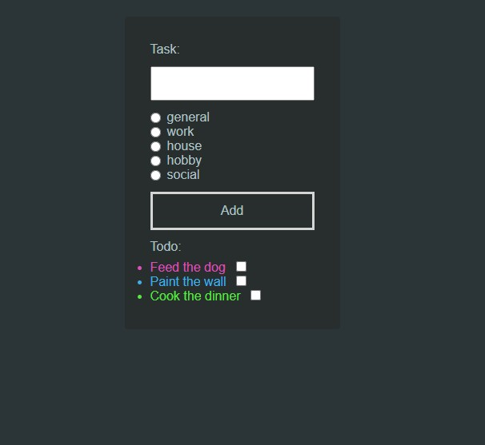

# Typescript-learn-todo-app

Simple app created for learn and practice typescript. Nothing fancy, but the next step in developing the technology stack.

[link to youtube course](https://www.youtube.com/watch?v=5CBZ6DymX0Y&t=10773s&ab_channel=Jakzacz%C4%85%C4%87programowa%C4%87%3F)

## Project Overview

I wanted to focus on the basics of typescript, so I decided on very basic development and styling tools.

- TypeScript – for application logic
- HTML – for markup and structure
- plain CSS file – for simply styling

##   Thanks / Special thanks / Credits

Thanks to [@JZP](https://www.youtube.com/@JZP) for free acces to amazing learning tools!
